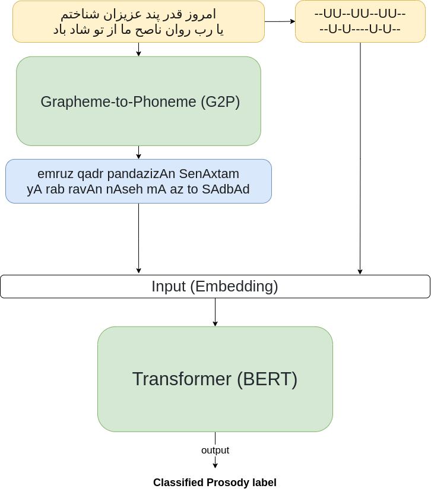

# persian poem rhythm recognition

## What is it?
Recognizing the rhythm of a poem is one of the most challenging aspects of
Persian literature. It’s an intriguing area for research because there have been a
few prior studies in this field. The transformer is used by the system to identify
the beat. This technique is used. The results demonstrate extremely high
accuracy with minimal effort in terms of time and resources. The best accuracy
of the model was reported for the corresponding architecture of transformers
network was **90.95** percent with accuracy metric on hole new unseen data set
of the test data set.

## How it works
We used transformers for this task with the following architecture.
As it can be seen in Fig 1, the input poem line is going to be fed to trans-
formers. For getting proper embedding we combine a corresponding u-dash
string of poem line as input too. The poem line is going to be converted to
proper phoneme syntax which is used commonly for TTS tasked. The Arrived
phoneme and u-dash representation are combined in a special format and make
input embedding. For better Performance, we used a pre-trained model for G2P
module in the network to make better predictions. G2P pre-trained model used
nearly 48K words as dictionary table and stemm other words to match unseen
words based on network architecture Input embedding is fed to the Transformer
layer, we used Bert as the Main choice for transformers due to its permanence
in the multi-classification tasks (Bert)

## Research and Development
### Classic Classifiers
once I tried to get direct embedding from provided data seemed to use full for
prosody detection. Label encoder has been used both for cv-files and u-dash
files. Encoder converts c, v, and V in cv-files to corresponding numbers in their
space and convert -, and U similarly for other files. This phase remains the same
1Figure 1: Network basic architecture
2for both developments in the train set and validation set and production phase
which is for the test set. these new embedding has been padded with zero, make
sure all the embedding sizes are fit together. For evaluation, I first tried some
classic approaches as ones that were used in the original paper themselves.
Classic models which were used:
+ Logistic Regression
+ Gaussian Naive Base
+ K Nearest Neighbors
+ Multi Layer Perceptron
+ SVM with both linear and non-linear kernel
+ Decision Tree
+ XGBoost
+ Gradient Boosting Ada boost classifier  

I also try to combine an ensemble classifier to get higher accuracy on non-
seen poems in the test set. For example, I used a Voting classifier and apply
majority vote to classifier decisions.
In all of the above experiments, the best result was achieved from classifiers
like KNN, and ensembles ones contained SVM was around 47 percent accuracy
maximum.

### Ganjor Embedding
Running Skip-gram model with small window on all of the crawled poems from
awesome Ganjor data set made and Em-bedder which can consider not only
the word but also its context. Each embedding size was configured to be 50
items for the model. This new embedding itself doesn’t get lots of meaning to
the model. It needs at least information from u-dash. Otherwise, it must be
chunked by the number of 6 to 8 varies by hemstitch itself based on the prosody
of that poem, which makes it a cyclic problem and get conflict with the main
problem itself. Also averaging each part of hemstitch and adding them to the
previously derived data set only increased the defined model by near 9 percent,
it ended progress near 56 and 57 at most.

### Modifying Arabic prosody model
I modified the Arabic prosody model called Arud (arrudy) 1 or ”Science of Po-
etry” that can be used for the Persian language too. It adds forgotten diacritics
and detecting poetry meter and etc. Using it on poems like the following will
cause to get more information about reading the poem inside the computer, also
it performs very well on its task, arrudy got to the main problem.

> (aruudy) is Arabic package toolkit see more in [repo](https://github.com/kariminf/aruudy)

1. The main concept of character replacement and vowel fixing did by regex,
not a learning process. All expression and updated was hardcoded in the
package

2. The simplicity of the package can be better by sanitizing do auddy detection process and guessing the combination of all chunks of steamed, but
there was no data to make the model learn this part of the task correctly.
example of aruudy normalization and prosody formation.

من با تو حدیث بی زبان گویم

will be converted to:

مٓن بَا تُو حٓدیث بِی زٓبَان گُویم

## 😲 Cognitive neuroscientist fact
The left hemisphere may handle the lion’s share of language processing, but the right hemisphere does make some contributions. 
The `right superior temporal sulcus` plays a role in processing the **rhythm of language** (prosody), and the right prefr ontal cortex, middle
temporal gyrus, and posterior cingulate activate when sentences have metaphorical meaning.

## Used or inspired by 

- [PersianG2P](https://github.com/PasaOpasen/PersianG2P)
- [aruudy](https://github.com/kariminf/aruudy)
- [Arooz](https://github.com/fffaraz/Arooz)

